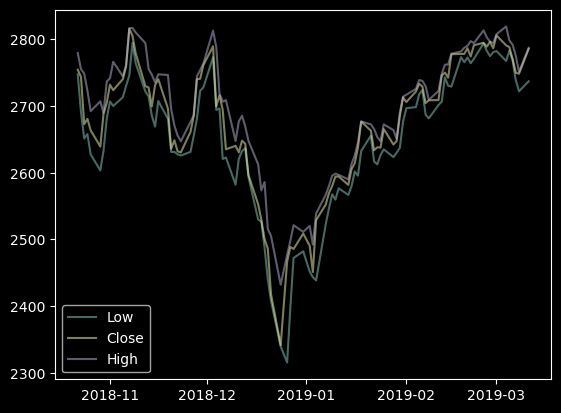
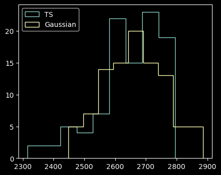
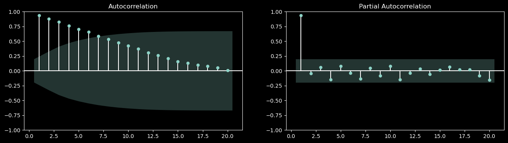
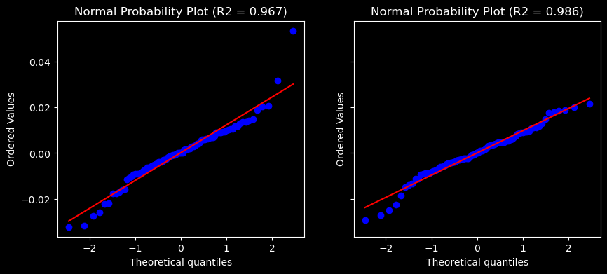

# plotting


<!-- WARNING: THIS FILE WAS AUTOGENERATED! DO NOT EDIT! -->

------------------------------------------------------------------------

<a
href="https://github.com/vtecftwy/myquantlab/blob/main/myquantlab/plotting.py#L23"
target="_blank" style="float:right; font-size:smaller">source</a>

### plot_timeseries

>  plot_timeseries (*tseries:pandas.core.series.Series,
>                       ax:Optional[matplotlib.axes._axes.Axes]=None,
>                       add_legend:bool=False)

<table>
<colgroup>
<col style="width: 6%" />
<col style="width: 25%" />
<col style="width: 34%" />
<col style="width: 34%" />
</colgroup>
<thead>
<tr>
<th></th>
<th><strong>Type</strong></th>
<th><strong>Default</strong></th>
<th><strong>Details</strong></th>
</tr>
</thead>
<tbody>
<tr>
<td>tseries</td>
<td>Series</td>
<td></td>
<td></td>
</tr>
<tr>
<td>ax</td>
<td>Optional</td>
<td>None</td>
<td></td>
</tr>
<tr>
<td>add_legend</td>
<td>bool</td>
<td>False</td>
<td></td>
</tr>
<tr>
<td><strong>Returns</strong></td>
<td><strong>None</strong></td>
<td></td>
<td><strong>one of several np.Series with DataTimeIndex<br>axis to plot
<br>add legend to plot, when True</strong></td>
</tr>
</tbody>
</table>

``` python
df = load_test_df()
plot_timeseries(df.Low, df.Close, df.High, add_legend=True)
```



------------------------------------------------------------------------

<a
href="https://github.com/vtecftwy/myquantlab/blob/main/myquantlab/plotting.py#L41"
target="_blank" style="float:right; font-size:smaller">source</a>

### hist_timeseries

>  hist_timeseries (*tseries:pandas.core.series.Series,
>                       ax:Optional[matplotlib.axes._axes.Axes]=None)

``` python
hist_timeseries(df.Low)
```



------------------------------------------------------------------------

<a
href="https://github.com/vtecftwy/myquantlab/blob/main/myquantlab/plotting.py#L68"
target="_blank" style="float:right; font-size:smaller">source</a>

### plot_acfs

>  plot_acfs (*tseries, incl_lag0=False, alpha=0.05, ax=None)

``` python
plot_acfs(df.Close, df.High)
```




------------------------------------------------------------------------

<a
href="https://github.com/vtecftwy/myquantlab/blob/main/myquantlab/plotting.py#L79"
target="_blank" style="float:right; font-size:smaller">source</a>

### normal_probability_plot

>  normal_probability_plot (*tseries, ax=None)

``` python
normal_probability_plot(df.Close.pct_change().dropna(), df.High.pct_change().dropna())
```


